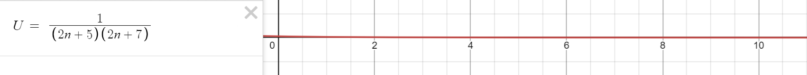
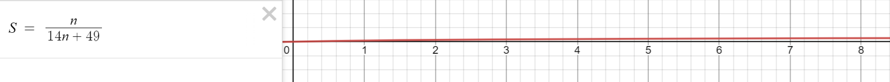

**Задание 1**

*Условие*

Дана последовательность $U_n = \frac{1}{(2n+5)(2n+7)}$. 
1) Доказать, что $U_n$ - бесконечно малая. 
2) Найти такое $n_0$, начиная с которого $\lvert U_n \rvert < \epsilon = 10^{-4}$.
3) Составить последовательность $S_n = \sum_{k=1}^n$. Доказать, что $S_n$ имеет предел и найти его.
4) Проверить результат в $Desmos$.

*Решение*
$$
    U_n = \frac{1}{(2n+5)(2n+7)}
$$
1)
$$ 
    \lim_{x \to \infty} = \frac{1}{(2n+5)(2n+7)} = 0 \\
$$

$$
    \forall \epsilon>0, \quad \exists n_0 \in \mathbb{N} \quad | \quad \forall n > n_0 \! : \quad \lvert \frac{1}{(2n+5)(2n+7)} \rvert < \epsilon \\
$$ 

$$
    \lvert \frac{1}{(2n+5)(2n+7)} \rvert = \frac{1}{(2n+5)(2n+7)} \le \frac{1}{4n^2} \\
$$

$$
    \lvert \frac{1}{(2n+5)(2n+7)} \rvert = \frac{1}{4n^2} < \frac{1}{4n_0^2} \le \epsilon \\
$$

$$
    n_0 \ge \sqrt{\frac{1}{4\epsilon}} = \frac{1}{2\sqrt{\epsilon}} \\
$$

$$
    \therefore \exists{n_0} = \lceil\frac{1}{4\epsilon}\rceil \therefore 0 - предел
$$

2)

$$
    n_0: \lvert U_n \rvert < \epsilon = 10^{-4}
$$

$$
    n_0 = \lceil \frac{1}{4\epsilon} \rceil = 2500
$$
3)
$$
    S_n = \sum_{k = 1}^{n} U_n = \sum_{k = 1}^{n} \frac{1}{(2n+5)(2n+7)} =\sum_{k = 1}^{n} (\frac{1}{2(2k+5)} - \frac{1}{2(2k+7)}) = \sum_{k = 1}^{n} S_{1k} - \sum_{k = 1}^{n} S_{2k}
$$

$$
    \forall L \in \mathbb{N}: S_{1(L)} - S_{2(L-1)} = 0
$$

$$
    \therefore \sum_{k = 1}^{n} S_{1k} - S_{2k} = S_{11} - S_{2k} = \frac{1}{14} - \frac{1}{4n + 49} = \frac{n}{14n + 49}
$$
$Функция$ $монотонна$ $и$ $ограничена$
$$
    \therefore \lim_{n \to \infty} \frac{1}{14n + 49} = \lim_{n \to \infty} \frac{n}{n} \cdot \frac{1}{14 + \frac{49}{n}} = \frac{1}{14}
$$
4) 
https://www.desmos.com/calculator/b1v5jxz8ri?lang=ru

https://www.desmos.com/calculator/3jci2djyvx?lang=ru

НОМИР 2

$$
    f(x) = \frac{x^2 + 2x - 8}{\lvert x + 4 \rvert} = \frac{(x+4)(x-2)}{\lvert x + 4 \rvert}
$$

$$
    \lim_{x \to +\infty} f(x) = +\infty
$$

$$
    \lim_{x \to -\infty} f(x) = +\infty
$$

$$
    \lim_{x \to -4-0} f(x) = 6
$$

$$
    \lim_{x \to -4+0} f(x) = -6
$$

$$
    g(x) = -1 + \frac{\lvert x + 4 \rvert}{(x+4)(x-2)}
$$

$$
    \lim_{x \to +\infty} g(x) = -1
$$

$$
    \lim_{x \to -\infty} g(x) = -1
$$

$$
    \lim_{x \to -4-0} g(x) = -1 + \frac{1}{6} = -\frac{5}{6}
$$

$$
    \lim_{x \to -4+0} g(x) = -1 - \frac{1}{6} = -\frac{7}{6}
$$

$$
    \lim_{x \to -2-0} g(x) = -\infty
$$

$$
    \lim_{x \to -2+0} g(x) = +\infty
$$

НОМИР 3

$$
    \exists \lim_{x \to x_0} f(x) \ne f(x_0)
$$

1)

$$
    f(x) = \begin{equation}
        \begin{cases}
            x^2, &x < 1 \\
            x + 1, & x \ge 1
        \end{cases}
    \end{equation}
$$

$$
    \lim_{x \to 1 - 0} f(x) = 1
$$

$$
    \lim_{x \to 1 + 0} f(x) = 2
$$

2)

$$
    f(x) = \begin{equation}
        \begin{cases}
            2 + \frac{1}{x + 1}, &x < -2 \\
            -1 + \frac{1}{x + 2}, & x \ge 2
        \end{cases}
    \end{equation}
$$

$$
    \lim_{x \to -2 - 0} f(x) = 1
$$

$$
    \lim_{x \to -2 + 0} f(x) = \infty
$$

$$
    \lim_{x \to -1} f(x) = 0
$$
