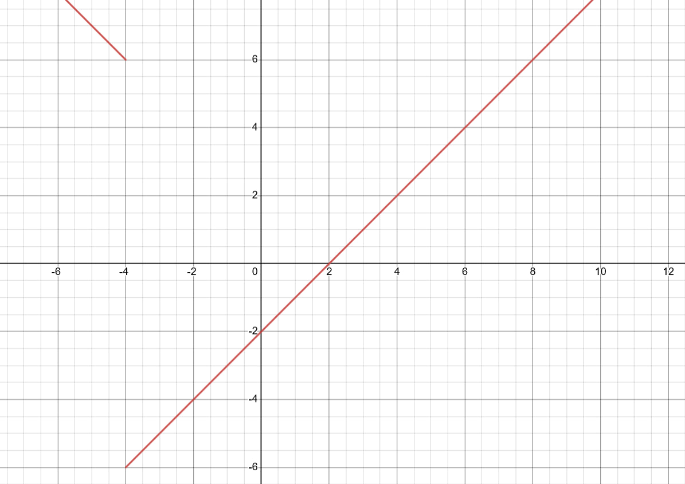
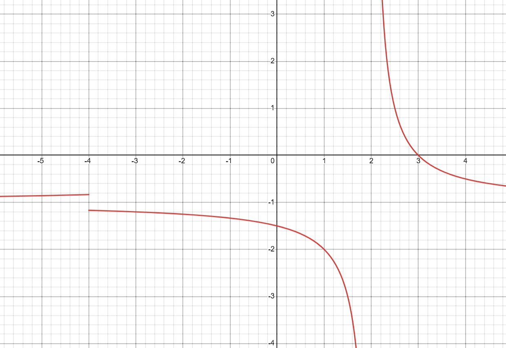

НОМИР 1

$$
    U_n = \frac{1}{(2n+5)(2n+7)}
$$

$$ 
    \lim_{x \to \infty} = \frac{1}{(2n+5)(2n+7)} = 0 \\
$$

$$
    \forall \epsilon>0, \quad \exists n_0 \in \mathbb{N} \quad | \quad \forall n > n_0 \! : \quad \lvert \frac{1}{(2n+5)(2n+7)} \rvert < \epsilon \\
$$ 

$$
    \lvert \frac{1}{(2n+5)(2n+7)} \rvert = \frac{1}{(2n+5)(2n+7)} \le \frac{1}{4n^2} \\
$$

$$
    \lvert \frac{1}{(2n+5)(2n+7)} \rvert = \frac{1}{4n^2} < \frac{1}{4n_0^2} \le \epsilon \\
$$

$$
    n_0 \ge \sqrt{\frac{1}{4\epsilon}} = \frac{1}{2\sqrt{\epsilon}} \\
$$

$$
    \therefore \exists{n_0} = \lceil\frac{1}{4\epsilon}\rceil \therefore 0 - предел
$$

$$
    n_0: \lvert U_n \rvert < \epsilon = 10^{-4}
$$

$$
    n_0 = \lceil \frac{1}{4\epsilon} \rceil = 2500
$$

$$
    S_n = \sum_{k = 1}^{n} U_n = \sum_{k = 1}^{n} \frac{1}{(2n+5)(2n+7)} =\sum_{k = 1}^{n} (\frac{1}{2(2k+5)} - \frac{1}{2(2k+7)}) = \sum_{k = 1}^{n} S_{1k} - \sum_{k = 1}^{n} S_{2k}
$$

$$
    \forall L \in \mathbb{N}: S_{1(L)} - S_{2(L-1)} = 0
$$

$$
    \therefore \sum_{k = 1}^{n} S_{1k} - S_{2k} = S_{11} - S_{2k} = \frac{1}{14} - \frac{1}{4n + 49} = \frac{n}{14n + 49}
$$
Функция монотонна и ограничена
$$
    \therefore \lim_{n \to \infty} \frac{1}{14n + 49} = \lim_{n \to \infty} \frac{n}{n} \cdot \frac{1}{14 + \frac{49}{n}} = \frac{1}{14}
$$

НОМИР 2

**Условие.**  
**Найти пределы функций $f(x)$ и $g(x)$ в $x = +\infty$ и в точках несуществования функций. Изобразить и проверить.**
$$
f(x) = \frac{x^2 + 2x - 8}{\lvert x + 4 \rvert}
$$

$$
g(x) = -1 + \frac{\lvert x + 4 \rvert}{(x+4)(x-2)}
$$  
  
**1.1 Найдём предел функции $f(x)$ в точке $x = +\infty$.**  

$$
    f(x) = \frac{x^2 + 2x - 8}{\lvert x + 4 \rvert} = \frac{(x+4)(x-2)}{\lvert x + 4 \rvert}
$$
Степень многочлена в числителе больше степени многочлена в знаменателе, а числитель и знаменатель при стремлении аргумента к $+\infty$ принимают положитиельные значения, значит мы можем говорить о том, что предел функции стремится к $+\infty$
$$
    \lim_{x \to +\infty} f(x) = +\infty
$$

**1.2 Аналогично найдём предел функции $f(x)$ при $x$ стремящемся к $-\infty$**
$$
    \lim_{x \to -\infty} f(x) = +\infty
$$

**1.3 Здесь точка несуществования фукнции $x = -4$. Проверим чему равен предел при $x$ стремящемся к $-4-0$. Заменим $-4-0$ на $-4- \epsilon$, где $\epsilon > 0$**
$$
    \lim_{x \to -4-\epsilon} f(x) = \lim_{x \to -4-\epsilon} \frac{(x+4)(x-2)}{\lvert x + 4 \rvert} = f(-4-\epsilon) = \frac{(-4 - \epsilon +4)(-4 - \epsilon -2)}{\lvert -4 -\epsilon + 4 \rvert} = \frac{-\epsilon (-6 - \epsilon)}{\lvert-\epsilon \rvert} = \frac{-\epsilon (-6 - \epsilon)}{\epsilon} = 6 + \epsilon \implies \lim_{x \to -4-0} f(x) = 6
$$

**1.4 Аналогично при $x$ стремящемся к $-4+0$. Заменим $-4+0$ на $-4+ \epsilon$, где $\epsilon > 0$**

$$
    \lim_{x \to -4+\epsilon} f(x) = \lim_{x \to -4+\epsilon} \frac{(x+4)(x-2)}{\lvert x + 4 \rvert} = f(-4+\epsilon) = \frac{(-4 + \epsilon +4)(-4 + \epsilon -2)}{\lvert -4 +\epsilon + 4 \rvert} = \frac{\epsilon (-6 + \epsilon)}{\lvert\epsilon \rvert} = \frac{\epsilon (-6 + \epsilon)}{\epsilon} = -6 + \epsilon \implies \lim_{x \to -4-0} f(x) = -6
$$

**1.5 При помощи desmos изобразим график функции**
https://www.desmos.com/calculator/losu1qrsmf

  

**2.1 Найдём предел функции $g(x)$ в точке $x = +\infty$.**  

$$
    g(x) = -1 + \frac{\lvert x + 4 \rvert}{(x+4)(x-2)}
$$

Степень многочлена в числителе меньше степени многочлена в знаменателе,  а числитель и знаменатель при стремлении аргумента к $+\infty$ принимают положитиельные значения, значит мы можем говорить о том, что дробь стремится к $0$, а значит значение предела равно $-1$

$$
    \lim_{x \to +\infty} g(x) = -1
$$

**2.2 Аналогично найдём предел функции $f(x)$ при $x$ стремящемся к $-\infty$**
$$
    \lim_{x \to -\infty} g(x) = -1
$$

**2.3 Здесь точки несуществования фукнции: $x = -4$ и $x = -2$. Проверим чему равен предел при $x$ стремящемся к $-4-0$. Заменим $-4-0$ на $-4- \epsilon$, где $\epsilon > 0$**

$$
    \lim_{x \to -4-\epsilon} g(x) = \lim_{x \to -4-\epsilon} -1 + \frac{\lvert x + 4 \rvert}{(x + 4)(x - 2)} = g(-4-\epsilon) = -1 + \frac{\lvert -4 -\epsilon + 4 \rvert}{(-4 - \epsilon +4)(-4 - \epsilon -2)} = -1 + \frac{\lvert-\epsilon \rvert}{-\epsilon (-6 - \epsilon)} = -1 + \frac{\epsilon}{\epsilon (-6 - \epsilon)} = -1 + \frac{1}{-6 - \epsilon} = -\frac{5}{6}  
$$

$$
    \implies \lim_{x \to -4-0} g(x) = -\frac{5}{6}
$$

**2.4 Аналогично при $x$ стремящемся к $-4+0$.**

$$
    \lim_{x \to -4+0} g(x) = -1 - \frac{1}{6} = -\frac{7}{6}
$$

**2.5 Найдем значение предела при $x$ стремящемся к $-2 - 0$. Заменим $-2-0$ на $-2 - \epsilon$, где $\epsilon > 0$**

$$
    \lim_{x \to -2-\epsilon} g(x) = g(-2 - \epsilon) =  -1 + \frac{\lvert -2 -\epsilon + 4 \rvert}{(-2 -\epsilon + 4)(-2 -\epsilon - 2)} = -1 + \frac{\epsilon + 2}{(2 - \epsilon)(-\epsilon - 4)} = -1 + \frac{\epsilon + 2}{\epsilon^2 + 2\epsilon - 8} = -1 - \frac{1}{4} = -\frac{5}{4}
$$

**2.6 Аналогично для $x$ стремящемся к $-2 + 0$**

$$
    \lim_{x \to -2+0} g(x) = -\frac{5}{4}
$$

**2.7 При помощи desmos изобразим график функции**
https://www.desmos.com/calculator/olelwbxdrq

НОМИР 3

$$
    \exists \lim_{x \to x_0} f(x) \ne f(x_0)
$$

1)

$$
    f(x) = \begin{equation}
        \begin{cases}
            x^2, &x < 1 \\
            x + 1, & x \ge 1
        \end{cases}
    \end{equation}
$$

$$
    \lim_{x \to 1 - 0} f(x) = 1
$$

$$
    \lim_{x \to 1 + 0} f(x) = 2
$$

2)

$$
    f(x) = \begin{equation}
        \begin{cases}
            2 + \frac{1}{x + 1}, &x < -2 \\
            -1 + \frac{1}{x + 2}, & x \ge 2
        \end{cases}
    \end{equation}
$$

$$
    \lim_{x \to -2 - 0} f(x) = 1
$$

$$
    \lim_{x \to -2 + 0} f(x) = \infty
$$

$$
    \lim_{x \to -1} f(x) = 0
$$
